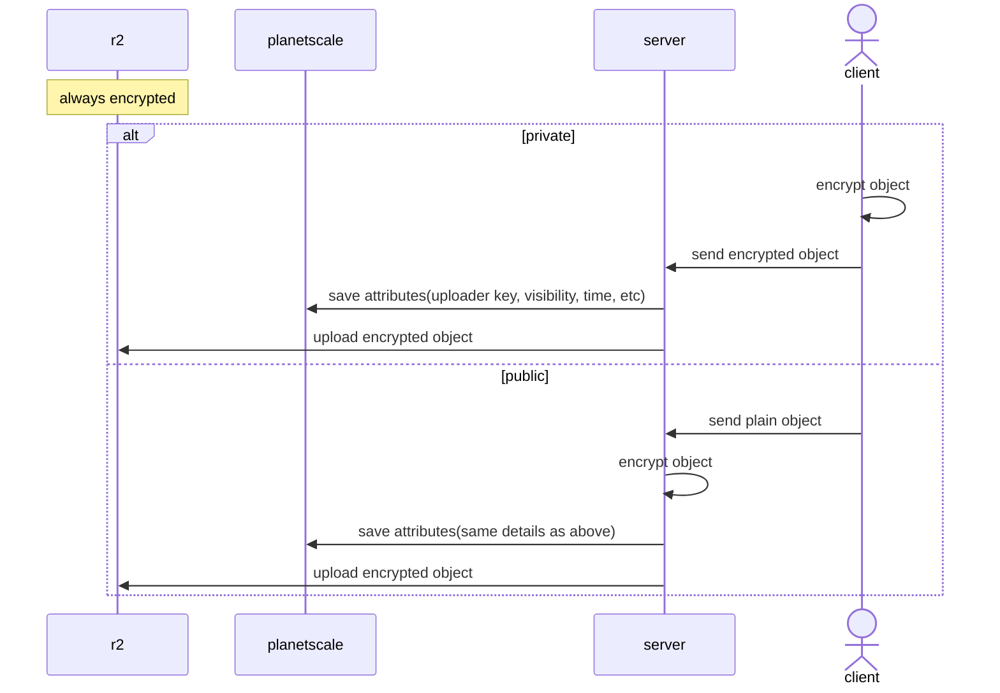
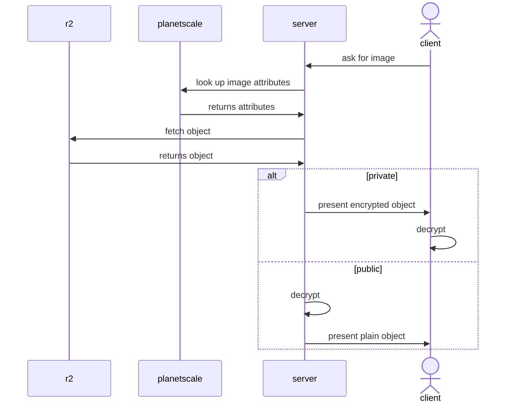
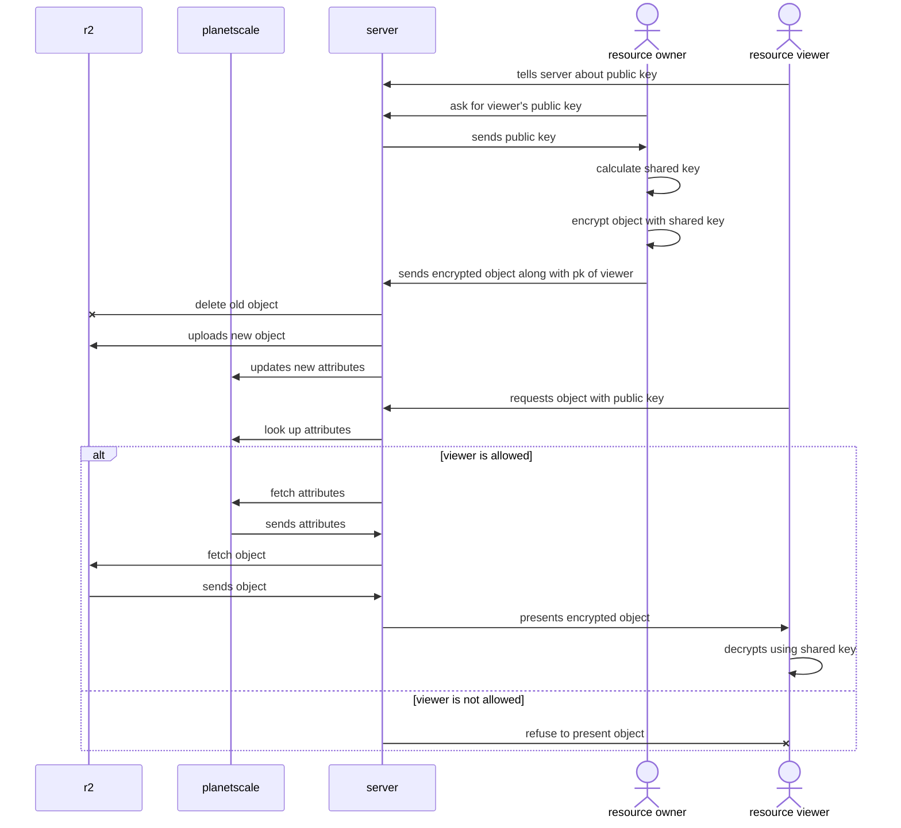

# api

## image upload flow

```mermaid
sequenceDiagram
  participant r2
  note over r2: always encrypted
  participant db as planetscale
  participant s as server
  actor c as client

  alt private
    c->>c: encrypt object
    c->>s: send encrypted object
    s->>db: save attributes(uploader key, visibility, time, etc)
    s->>r2: upload encrypted object
  else public
    c->>s: send plain object
    s->>s: encrypt object
    s->>db: save attributes(same details as above)
    s->>r2: upload encrypted object
  end
```

## image view flow

```mermaid
sequenceDiagram
  participant r2
  participant db as planetscale
  participant s as server
  actor c as client

  c->>s: ask for image
  s->>db: look up image attributes
  db->>s: returns attributes
  s->>r2: fetch object
  r2->>s: returns object
  alt private
    s->>c: present encrypted object
    c->>c: decrypt
  else public
    s->>s: decrypt
    s->>c: present plain object
  end
```

## sharing private

```mermaid
sequenceDiagram
  participant r2
  participant db as planetscale
  participant s as server
  actor o as resource owner
  actor v as resource viewer

  v->>s: tells server about public key
  o->>s: ask for viewer's public key
  s->>o: sends public key
  o->>o: calculate shared key
  o->>o: encrypt object with shared key
  o->>s: sends encrypted object along with pk of viewer
  s-xr2: delete old object
  s->>r2: uploads new object
  s->>db: updates new attributes

  v->>s: requests object with public key
  s->>db: look up attributes
  alt viewer is allowed
    s->>db: fetch attributes
    db->>s: sends attributes
    s->>r2: fetch object
    r2->>s: sends object
    s->>v: presents encrypted object
    v->>v: decrypts using shared key
  else viewer is not allowed
    s-xv: refuse to present object
  end
```
