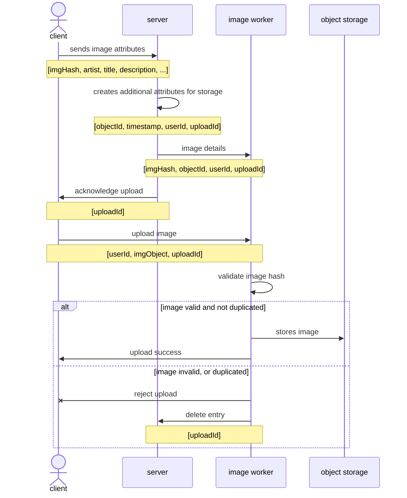

```mermaid
sequenceDiagram
  actor client
  participant server
  participant img as image worker
  participant r2 as object storage
  
  client->>server: sends image attributes
  Note over client,server: [imgHash, artist, title, description, ...]

  server->>server: creates additional attributes for storage
  Note over server: [objectId, timestamp, userId, uploadId]

  server->>img: image details
  Note over server,img: [imgHash, objectId, userId, uploadId]

  server->>client: acknowledge upload
  Note over server,client: [uploadId]

  client->>img: upload image
  Note over client,img: [userId, imgObject, uploadId]

  img->>img: validate image hash
  alt image valid and not duplicated
    img->>r2: stores image
    img->>client: upload success
  else image invalid, or duplicated
    img-xclient: reject upload
    img->>server: delete entry
    Note over img,server: [uploadId]
  end
```
